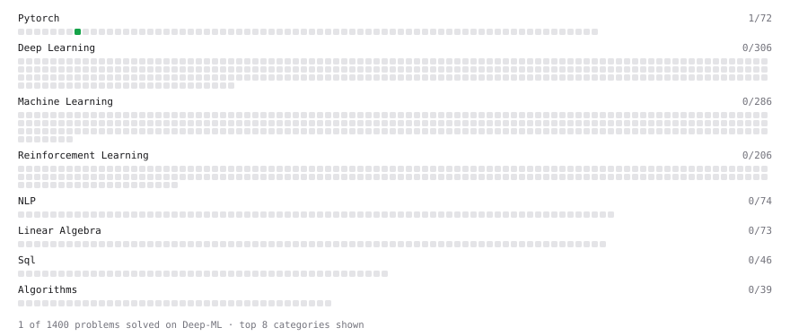

# Deep-ML

My machine learning practice from [Deep-ML](https://www.deep-ml.com). Every solution here was written by hand.

**7** solved · 2 problems · 2 labs · 3 math

[**Browse the interactive portfolio**](https://AshainX.github.io/deep-ml/) to replay this filling in over time.

## Problems

| | Difficulty | Solved | |
| --- | --- | --- | --- |
| [Build an MLP with nn.Sequential](https://www.deep-ml.com/problems/887) | easy | 2026-09-15 | [solution](problems/0887-build-an-mlp-with-nn-sequential) |
| [Classify LLM Prefill vs Decode as Compute-Bound or Memory-Bound](https://www.deep-ml.com/problems/417) | medium | 2026-09-21 | [solution](problems/0417-classify-llm-prefill-vs-decode-as-compute-bound-or-memory-bound) |

## Labs

| | Difficulty | Solved | |
| --- | --- | --- | --- |
| [Design Your Own Activation Function](https://www.deep-ml.com/labs/9) | easy | 2026-09-16 | [solution](labs/0009-design-your-own-activation-function) |
| [Train a Binary Classifier](https://www.deep-ml.com/labs/23) | easy | 2026-09-16 | [solution](labs/0023-train-a-binary-classifier) |

## Math

| | Difficulty | Solved | |
| --- | --- | --- | --- |
| [LoRA Parameter and Compute Arithmetic](https://www.deep-ml.com/math-problems/154) | easy | 2026-09-15 | [solution](math/0154-lora-parameter-and-compute-arithmetic) |
| [Matrix Basics](https://www.deep-ml.com/math-problems/9) | easy | 2026-09-21 | [solution](math/0009-matrix-basics) |
| [Vector Operations](https://www.deep-ml.com/math-problems/7) | easy | 2026-09-18 | [solution](math/0007-vector-operations) |

---

_This file is regenerated by Deep-ML on every push._
